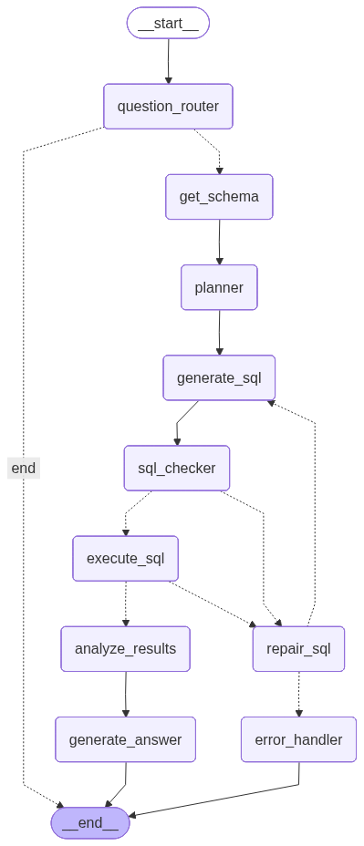
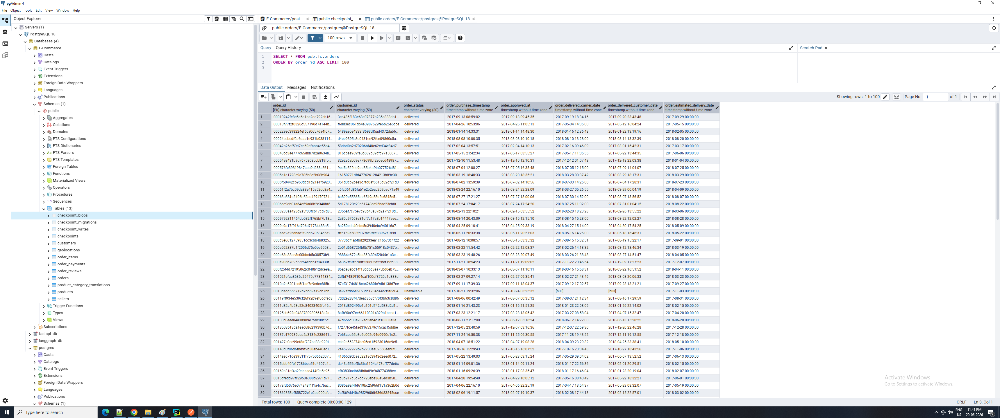
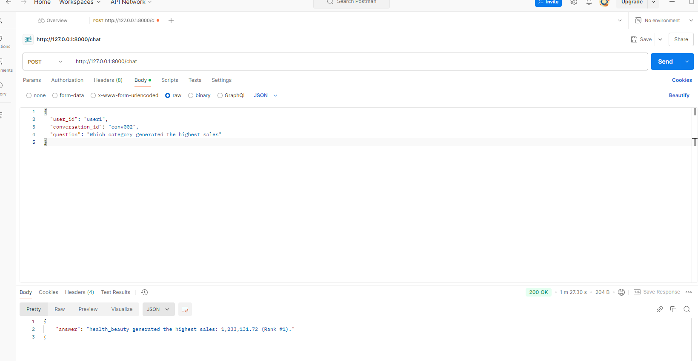

# agentic-sql-rag

An **agentic SQL RAG** system that answers natural-language questions about an e-commerce database. Instead of doing a single LLM-to-SQL hop, it runs a multi-step [LangGraph](https://langchain-ai.github.io/langgraph/) workflow that routes, plans, generates, validates, repairs, executes, and analyzes SQL — with automatic retries and conversational memory — exposed over a FastAPI `/chat` endpoint.

The dataset is the public [Brazilian E-Commerce (Olist)](https://www.kaggle.com/datasets/olistbr/brazilian-ecommerce) data loaded into PostgreSQL.

## Worflow diagram


## Features

- **Domain routing** — rejects out-of-scope questions before any SQL is generated.
- **Plan → generate → check → execute pipeline** — a planner produces a high-level query plan, then SQL is generated, syntax-checked, and run against PostgreSQL.
- **Self-healing SQL** — failed validation or execution loops back through a repair node, up to 3 retries, before falling back to a graceful error answer.
- **Conversational memory** — per-conversation state persisted in PostgreSQL via LangGraph's `PostgresSaver` checkpointer, so follow-up questions ("who spent the least among *them*?") resolve against prior context.
- **Schema caching** — the DB schema is loaded once and reused across requests.
- **LangSmith tracing** — full run tracing for debugging and evaluation.

## Architecture

The workflow is a `StateGraph` defined in [`graph/graph.py`](graph/graph.py). Each node is a step in answering the question:

| Node | Responsibility |
|------|----------------|
| `question_router` | Decide if the question is in the e-commerce domain; short-circuit if not |
| `get_schema` | Load the (cached) database schema |
| `planner` | Produce a high-level execution plan (tables, joins, filters, aggregations) |
| `generate_sql` | Generate PostgreSQL from the plan, schema, and question |
| `sql_checker` | Validate / correct the SQL with `QuerySQLCheckerTool` |
| `repair_sql` | Build repair context and increment the retry counter on failure |
| `execute_sql` | Run the query against PostgreSQL |
| `analyze_results` | Summarize and extract insights from the rows |
| `generate_answer` | Produce the final user-facing answer and append to memory |
| `error_handler` | Return a graceful failure message after exhausting retries |

```
START → question_router ─(not relevant)→ END
                │ (relevant)
                ▼
           get_schema → planner → generate_sql → sql_checker
                                        ▲              │
                                        │        (valid)│(invalid)
                                  generate_sql          ▼
                                        ▲          execute_sql ─(db error)→ repair_sql
                                        │              │                        │
                                   repair_sql ◄────────┘                  (retry<3) │
                                        │ (retry≥3)                             ▼
                                        ▼                              analyze_results → generate_answer → END
                                  error_handler → END
```

The rendered graph is generated to [`workflow_image/app_graph.png`](workflow_image/app_graph.png).

## Tech Stack

- **Python** ≥ 3.12
- **LangGraph** — agent workflow orchestration
- **LangChain** + **langchain-openai** — LLM and SQL tooling (uses the OpenAI `gpt-5` model)
- **FastAPI** + **Uvicorn** — HTTP API
- **PostgreSQL** — data store and LangGraph checkpointer (via `psycopg` / `psycopg2`)
- **LangSmith** — tracing and observability
- **uv** — dependency and environment management

## Prerequisites

- Python 3.12+
- A running PostgreSQL instance
- An OpenAI API key
- (Optional) A LangSmith API key for tracing

## Setup

### 1. Install dependencies

This project uses [`uv`](https://docs.astral.sh/uv/):

```bash
uv sync
```

### 2. Configure environment variables

Copy `.env.sample` to `.env` and fill in your keys:

```bash
cp .env.sample .env
```

```env
OPENAI_API_KEY=your-openai-key
LANGSMITH_API_KEY=your-langsmith-key
LANGSMITH_TRACING=true
LANGSMITH_ENDPOINT=https://api.smith.langchain.com
LANGSMITH_PROJECT=agentic-sql-rag
```

> **Note:** The PostgreSQL connection string is currently hard-coded in [`core/db.py`](core/db.py) and [`memory/memory.py`](memory/memory.py) as
> `postgresql://postgres:<password>@localhost:5432/E-Commerce`. Update these to match your database, or refactor them to read from the environment.

### 3. Load the database

Create the schema and import the Olist dataset by following the steps in
[`sql_table_data_import/how-to-insert-mock-data-into-tables.md`](sql_table_data_import/how-to-insert-mock-data-into-tables.md). This creates the `customers`, `geolocations`, `sellers`, `products`, `product_category_translations`, `orders`, `order_items`, `order_payments`, and `order_reviews` tables and populates them from CSV.

## Running the API

Start the FastAPI server with Uvicorn:

```bash
uv run uvicorn main:app --reload
```

The interactive API docs are then available at `http://localhost:8000/docs`.

### Generating the workflow diagram

Running `main.py` directly renders the graph to `workflow_image/app_graph.png`:

```bash
uv run python main.py
```

## API

### `POST /chat`

Ask a question. Conversation state is keyed by `user_id` + `conversation_id`, enabling multi-turn follow-ups.

**Request body**

```json
{
  "user_id": "user-123",
  "conversation_id": "conv-1",
  "question": "Who are the top 10 customers based on total spending?"
}
```

**Response**

```json
{
  "answer": "Top 10 customers by total spending: ..."
}
```

See [`sample_questions_and_answers.md`](sample_questions_and_answers.md) for a catalog of example questions (from simple aggregations to multi-step reasoning queries) and their answers.

## Testing

```bash
uv run pytest
```

Tests live in [`tests/`](tests/) and invoke the graph end-to-end (a live database and API key are required).

## Project Structure

```
agentic-sql-rag/
├── main.py                  # FastAPI app entrypoint + graph image renderer
├── api/                     # FastAPI router and request/response models
├── graph/                   # LangGraph StateGraph, state, and conditional edges
├── nodes/                   # Node implementations (router, planner, generate_sql, ...)
├── core/                    # DB connection, LLM config, schema cache
├── tools/                   # SQL checker tool
├── prompts/                 # System prompts for each node
├── memory/                  # PostgreSQL checkpointer for conversational memory
├── tests/                   # End-to-end workflow tests
├── sql_table_data_import/   # Schema DDL + data-import instructions
├── sample_questions_and_answers.md
└── workflow_image/          # Rendered graph diagram
```
## DB Structure (1M records)


## Chat Demo
